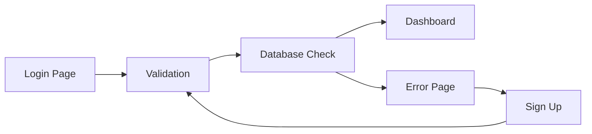
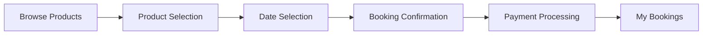
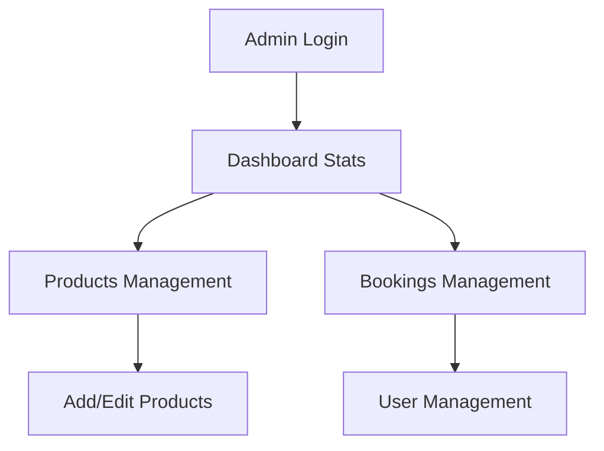

# Quick Gear - Project Documentation

## Overview

Quick Gear is a full-featured platform for managing product catalogs, user authentication, shopping, and order management. Built with PHP, MySQL (via PDO), and modern front-end techniques, the project emphasizes modular design, security best practices, and responsive layouts. This documentation outlines every aspect of the site to help new users get started and understand its inner workings.

## Getting Started

### Server Requirements

- XAMPP with Apache, PHP, and MySQL
- Composer (if applicable)

### Installation Steps

- Clone or download the repository into `c:\xampp\htdocs\quick-gear`
- Run `composer install` (if the project uses Composer dependencies)
- Edit `config.php` with your database and server settings
- Configure file permissions as needed

### Creating & Configuring the Database

- Open phpMyAdmin via XAMPP.
- Create a new database (e.g., `quick_gear_db`).
- Import the SQL schema found in `database/quick_gear_schema.sql`. Note: In some distributions, the SQL file may reside in `db/quick-gear-db.sql`.
- Update the database credentials in `config.php` accordingly.
- For production, ensure sensitive data (e.g., passwords) are hashed and secured.

## Functionalities

- **User Authentication:**

  - Secure registration, login, logout and session management via `includes/init.php`
  - Role-based access for admins and users

- **Product Catalog & Listing:**

  - View, search, and filter products with details including pricing, images, and descriptions
  - Admin and user-specific interfaces for listing and renting items

- **Shopping & Order Management:**

  - Shopping cart and secure checkout process
  - Order history available in user dashboards (see `bookings.php`)
  - Administrative tools to manage orders

- **Front End & Responsive Design:**
  - Utilizes modern JavaScript interactions and CSS frameworks for transitions (e.g., smooth grid animations in `includes/main.php`)
  - Optimized for both desktop and mobile devices

## Project Structure

- `index.php`: Main dispatcher and entry point.
- `/assets`: Static resources including CSS, JavaScript, and images.
- `/includes`: Contains reusable PHP components (such as `init.php` for session management and `main.php` for UI dynamics).
- `config.php`: Environment and database configuration.
- `/database` or `/db`: Contains SQL schema files.
- `/admin`: Administrative functionalities.
- `/user`: User-specific interfaces and logic.
- Other directories as needed for additional modules and features.

## How the Project Works

- **Modular Design:**  
  Front controller (`index.php`) directs requests to dedicated controllers. Modules are divided by domain (e.g., user, admin, products).

- **Database Interaction:**

  - Uses PDO for secure database operations.
  - Database tables include proper foreign key constraints for data integrity.
  - Booking functionality (e.g., in `rent_item.php`) leverages auto-increment safeguards; ensure any manual AUTO_INCREMENT adjustments are revisited in production.

- **Security Practices:**
  - Sessions are managed with timeouts and require login verification.
  - Input validation and sanitization is crucial to prevent SQL injection.
  - In demo mode, plain text credentials are used but must be secured (hashed) in production.

## System Flowcharts

### User Authentication Flow

### Booking Process Flow

### Admin Dashboard Flow

## Contributing

- Fork the repository and create a new branch for new features or bug fixes.
- Submit a pull request with clear descriptions.
- Follow the coding standards outlined in this document while contributing.

## Troubleshooting

- Check XAMPP's server logs for errors.
- Verify database connection settings in the config file.
- Clear browser cache if experiencing UI issues.
- For login issues, verify user credentials in the database.
- If experiencing icon issues, check Font Awesome integration.

## Additional Instructions

### Project File Structure

- Root Directory: c:\xampp\htdocs\quick-gear
  - `index.php`: Main entry point and home page.
  - `login.php` & `signup.php`: User authentication pages.
  - `browse.php`: Product browsing interface.
  - `bookings.php`: User booking history and management.
  - `admin.php`: Administrative dashboard.
  - `/includes`: Header, footer, and main content components.
  - `/data`: Product and booking data files.
  - `/db`: Database schema (quick-gear-db.sql).